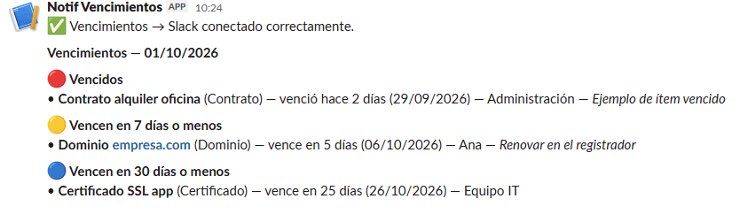

[English](README.md) | **Español**

# Vencimientos → Slack

Una planilla de Google Sheets que avisa en Slack **30, 7 y 1 día antes** de que venza un contrato, licencia, dominio, certificado SSL, seguro o lo que cargues.

Sin servidor y sin costo: todo corre con Apps Script dentro de la misma planilla. La instalación lleva unos 10 minutos. Disponible en español e inglés.



## Qué resuelve

Las fechas de vencimiento suelen estar en el calendario de una persona, en un mail viejo o en ningún lado. Cuando esa persona se va de vacaciones o deja la empresa, los recordatorios se van con ella. Esta herramienta deja la lista en un lugar compartido y los avisos en un canal que ve todo el equipo.

## Cómo funciona

- **Un mensaje por día como máximo.** Agrupa todo lo que cruzó un umbral (vencidos, hoy, mañana, ≤7 días, ≤30 días) en un solo mensaje. Si no hay nada nuevo, no manda nada.
- **Un aviso por umbral, no spam diario.** Cada ítem recibe un aviso al entrar en cada umbral, y nada más.
- **No depende del día exacto.** Si cargás algo que vence en 5 días, avisa ese mismo día. Si el trigger falló un día, avisa en la próxima corrida.
- **Renovar reinicia solo.** Actualizás la fecha de vencimiento y los avisos vuelven a empezar.
- **No pierde avisos.** Si Slack falla, no marca nada como avisado y reintenta en la próxima corrida.
- **Detecta fechas mal cargadas.** Una fecha imposible (31/02) o un texto que no es fecha se avisa una vez para que lo corrijas.

## Instalación

### 1. Crear el webhook de Slack

En `https://api.slack.com/apps`, entrá a *Create New App* → *From scratch*. Después abrí *Incoming Webhooks*, activalo, elegí *Add New Webhook to Workspace* y seleccioná el canal. Copiá la URL `https://hooks.slack.com/services/...`.

### 2. Pegar el script

1. Creá un Google Sheet nuevo.
2. **Desde la planilla**, andá a *Extensiones* → *Apps Script*. No crees el proyecto desde script.google.com: tiene que quedar adentro de la planilla.
3. Borrá el contenido de `Código.gs` y pegá el de [`Code.gs`](Code.gs).
4. **Idioma:** en la línea `const LANG = 'en';` cambiá `'en'` por `'es'`. Así el menú, la hoja y los mensajes quedan en español.
5. Guardá.

### 3. Alinear la zona horaria

En Apps Script, abrí ⚙️ *Configuración del proyecto* → *Zona horaria*. Tiene que ser **la misma** que la de la planilla (*Archivo* → *Configuración*). Si no coinciden, los días pueden quedar corridos en uno.

### 4. Usar el menú Vencimientos (en Google Sheets)

Todo este paso se hace **en la planilla de Google Sheets**, no en Slack ni en el editor de Apps Script.

1. Volvé a la pestaña del navegador donde está la planilla y recargala (F5).
2. Esperá unos segundos. En la barra de menús de arriba, a la derecha de *Ayuda*, aparece un menú nuevo: **Vencimientos**.

```
Archivo  Editar  Ver  Insertar  Formato  Datos  Herramientas  Extensiones  Ayuda  Vencimientos
```

> **¿No aparece?** Mirá [Problemas frecuentes](#problemas-frecuentes).

Hacé clic en **Vencimientos** y usá las opciones en este orden:

1. **Crear hoja de ejemplo.**
   - La primera vez, Google pide permisos: *Continuar* → elegí tu cuenta. Si aparece "Google no verificó esta app", entrá a *Configuración avanzada* → *Ir a (nombre del proyecto)* → *Permitir*. Es tu propio script, no una app de terceros.
   - Después de autorizar, **hacé clic de nuevo** en *Crear hoja de ejemplo*: la primera vez solo se autoriza, no se ejecuta.
   - Resultado: aparece una pestaña nueva abajo, `Vencimientos`, con 4 filas de prueba.
2. **Configurar webhook de Slack.** Se abre una ventana dentro de la planilla. Pegá la URL que copiaste en el paso 1 y apretá *Aceptar*.
3. **Enviar mensaje de prueba.** Andá a Slack: en el canal que elegiste tiene que aparecer "✅ Vencimientos → Slack conectado correctamente".
4. **Revisar ahora** (opcional). Manda a Slack los avisos de las filas de ejemplo, para que veas cómo queda el mensaje.
5. **Activar revisión diaria.** Desde ahora corre solo todos los días entre las 9 y las 10, aunque tengas la planilla cerrada.

Después borrá las filas de ejemplo (dejá la fila de encabezados) y cargá tus vencimientos reales.

## Columnas

| Columna | Obligatoria | Detalle |
|---|---|---|
| `Item` | Sí | Qué vence. Las filas sin Item se ignoran. |
| `Tipo` | No | Contrato, Licencia, Dominio, etc. |
| `Responsable` | No | Texto libre, o IDs de Slack separados por coma (`U01ABCDEFGH`) para mencionar a esas personas. Para ver un ID: perfil → ⋮ → *Copiar ID de miembro*. |
| `Vencimiento` | Sí | Celda con formato fecha, o texto `dd/mm/aaaa` o `aaaa-mm-dd`. |
| `Notas` | No | Se muestra en el aviso. |
| `Último aviso` | — | La maneja el script. No la edites. |

El orden de las columnas no importa: el script las busca por nombre.

## Personalizar

Todo se ajusta al principio de `Code.gs`:

- **Idioma.** `LANG`: `'es'` o `'en'`.
- **Umbrales.** Editá `CONFIG.BUCKETS` (mantené el orden de menor a mayor) y agregá la etiqueta correspondiente en `STRINGS.es.bucketLabels`.
- **Hora de la revisión.** Cambiá `CONFIG.TRIGGER_HOUR` y volvé a correr *Activar revisión diaria*.

## Problemas frecuentes

**No aparece el menú Vencimientos.** Revisá en este orden:

1. **El script tiene que estar adentro de la planilla.** Desde la planilla, andá a *Extensiones* → *Apps Script*. Si se abre un proyecto vacío, tu código quedó en un proyecto suelto, creado desde script.google.com: pegalo en este y guardá.
2. **Recargá la planilla** después de guardar. El menú se crea solo al abrirla.
3. **Si tenés varias cuentas de Google abiertas en el navegador,** los menús de Apps Script pueden no cargar. Abrí la planilla en una ventana de incógnito, con una sola cuenta.

Para confirmar que se ejecutó: en Apps Script → *Ejecuciones*, tiene que aparecer `onOpen` cada vez que abrís la planilla. Si no aparece, el script no está vinculado a esa planilla.

**Error "Falta el webhook" en Ejecuciones.** Significa que corriste la función antes de configurar el webhook. Configuralo desde el menú (paso 4.2). No uses el botón *Ejecutar* del editor para la configuración: las ventanas para pegar datos solo funcionan desde el menú de la planilla.

## Limitaciones

- **El webhook es visible para los editores.** La URL se guarda en las propiedades del script, y cualquiera con permiso de edición sobre la planilla puede verla. Compartí la planilla solo con quien corresponde. Si se filtra, revocá el webhook en Slack y creá otro.
- **Un solo canal.** Todos los avisos van al mismo canal.
- **Horario aproximado.** Google ejecuta el trigger en algún momento dentro de la hora configurada, no en un minuto exacto.
- **Los vencidos se avisan una sola vez.** No hay recordatorio insistente después del vencimiento.
- **Errores por mail.** Si el script falla, Google le manda un mail al dueño del script.

## Licencia

MIT
