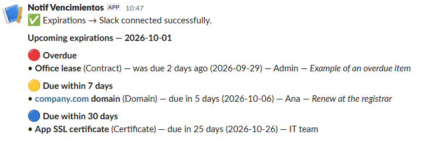

**English** | [Español](README.es.md)

# Expirations → Slack

A Google Sheet that alerts a Slack channel **30, 7 and 1 day before** a contract, license, domain, SSL certificate, insurance policy or anything else expires.

No server, no cost: it all runs on Apps Script inside the sheet itself. Setup takes about 10 minutes. Available in English and Spanish.



## The problem

Expiration dates usually live in one person's calendar, in an old email, or nowhere at all. When that person goes on vacation or leaves the company, the reminders leave with them. This keeps the list in a shared place and the alerts in a channel the whole team can see.

## How it works

- **At most one message a day.** Everything that crossed a threshold (overdue, today, tomorrow, ≤7 days, ≤30 days) is grouped into a single message. If there's nothing new, nothing is sent.
- **One alert per threshold, not daily spam.** Each item gets one alert when it enters each threshold, and that's it.
- **Doesn't depend on hitting the exact day.** Add something that expires in 5 days and you get alerted that same day. If a run is missed, the next one catches up.
- **Renewing resets it.** Update the due date and the alerts start over.
- **Doesn't lose alerts.** If Slack fails, nothing is marked as sent and it retries on the next run.
- **Flags bad dates.** An impossible date (Feb 31) or text that isn't a date is reported once so you can fix it.
- **One click to the sheet.** Every Slack message ends with a link that opens the expirations tab directly.
- **Color-coded sheet.** Overdue rows turn red and rows due within 7 days turn yellow, so you see what needs updating at a glance.

## Setup

### 1. Create the Slack webhook

At `https://api.slack.com/apps`, go to *Create New App* → *From scratch*. Open *Incoming Webhooks*, turn it on, choose *Add New Webhook to Workspace* and pick the channel. Copy the `https://hooks.slack.com/services/...` URL.

### 2. Paste the script

1. Create a new Google Sheet.
2. **From the sheet**, go to *Extensions* → *Apps Script*. Don't create the project from script.google.com: it has to live inside the sheet.
3. Replace the contents of `Code.gs` with [`Code.gs`](Code.gs).
4. Language: the line `const LANG = 'en';` sets the menu, sheet and messages to English. Change it to `'es'` for Spanish.
5. Save.

### 3. Match the time zone

In Apps Script, open ⚙️ *Project Settings* → *Time zone*. It must be **the same** as the sheet's (*File* → *Settings*). If they don't match, days can be off by one.

### 4. Use the Expirations menu (in Google Sheets)

This whole step happens **in the Google Sheet**, not in Slack or the Apps Script editor.

1. Go back to the browser tab with the sheet and reload it (F5).
2. Wait a few seconds. In the top menu bar, to the right of *Help*, a new menu appears: **Expirations**.

```
File  Edit  View  Insert  Format  Data  Tools  Extensions  Help  Expirations
```

> **Not showing?** See [Troubleshooting](#troubleshooting).

Click **Expirations** and use the options in this order:

1. **Create sample sheet.**
   - The first time, Google asks for permissions: *Continue* → choose your account. If you see "Google hasn't verified this app", click *Advanced* → *Go to (project name)* → *Allow*. It's your own script, not a third-party app.
   - After authorizing, **click *Create sample sheet* again**: the first click only authorizes, it doesn't run.
   - Result: a new tab appears at the bottom, `Expirations`, with 4 sample rows.
2. **Set up Slack webhook.** A dialog opens inside the sheet. Paste the URL from step 1 and click *OK*.
3. **Send test message.** Go to Slack: the channel you picked should show "✅ Expirations → Slack connected successfully."
4. **Check now** (optional). Sends the alerts for the sample rows so you can see what the message looks like.
5. **Enable daily check.** From now on it runs every day between 9 and 10 AM, even with the sheet closed.

Then delete the sample rows (keep the header row) and add your real expirations.

> **Already installed an earlier version?** Paste the new `Code.gs` (keep your `LANG` value), save, reload the sheet and click **Expirations** → **Apply colors**. The Slack link works from the next alert on.

## Columns

| Column | Required | Details |
|---|---|---|
| `Item` | Yes | What expires. Rows without an Item are ignored. |
| `Type` | No | Contract, License, Domain, etc. |
| `Owner` | No | Free text, or comma-separated Slack member IDs (`U01ABCDEFGH`) to @mention them. To find an ID: profile → ⋮ → *Copy member ID*. |
| `Due date` | Yes | A date-formatted cell, or text as `yyyy-mm-dd` or `mm/dd/yyyy`. |
| `Notes` | No | Shown in the alert. |
| `Last alert` | — | Managed by the script. Don't edit it. |

Column order doesn't matter: the script finds them by name. With `LANG = 'es'` the sheet and column names are in Spanish (see the [Spanish README](README.es.md)).

## Customize

Everything lives at the top of `Code.gs`:

- **Language.** `LANG`: `'en'` or `'es'`.
- **Thresholds.** Edit `CONFIG.BUCKETS` (keep them lowest to highest) and add the matching label in `STRINGS.en.bucketLabels`.
- **Check time.** Change `CONFIG.TRIGGER_HOUR` and run *Enable daily check* again.
- **Yellow highlight window.** `CONFIG.HIGHLIGHT_SOON_DAYS` (default 7). Set it to `0` to only highlight overdue rows in red. Run *Apply colors* after changing it.
- **Colors.** Edit `HIGHLIGHT_COLORS`. The script only replaces the color rules it created, so your own conditional formatting is kept.

## Troubleshooting

**The Expirations menu doesn't show up.** Check in this order:

1. **The script must live inside the sheet.** From the sheet, go to *Extensions* → *Apps Script*. If an empty project opens, your code ended up in a standalone project created from script.google.com: paste it into this one and save.
2. **Reload the sheet** after saving. The menu is only created when the sheet opens.
3. **If you're signed into several Google accounts in the browser,** Apps Script menus may not load. Open the sheet in an incognito window with a single account.

To confirm: in Apps Script → *Executions*, you should see `onOpen` every time you open the sheet. If it's not there, the script isn't bound to that sheet.

**"Webhook missing" error in Executions.** You ran the function before setting up the webhook. Set it up from the menu (step 4.2). Don't use the editor's *Run* button for setup: the input dialogs only work from the sheet menu.

## Limitations

- **The webhook is visible to editors.** The URL is stored in the script properties, and anyone with edit access to the sheet can see it. Share the sheet only with the right people. If it leaks, revoke the webhook in Slack and create a new one.
- **One channel.** All alerts go to the same channel.
- **Approximate timing.** Google runs the trigger at some point within the configured hour, not at an exact minute.
- **Overdue items are alerted once.** There's no repeated reminder after the due date.
- **Email on errors.** If the script fails, Google emails the script owner.
- **Colors need real dates.** Row colors only apply to date-formatted cells. Dates typed as plain text still get Slack alerts, but no color.

## License

MIT
